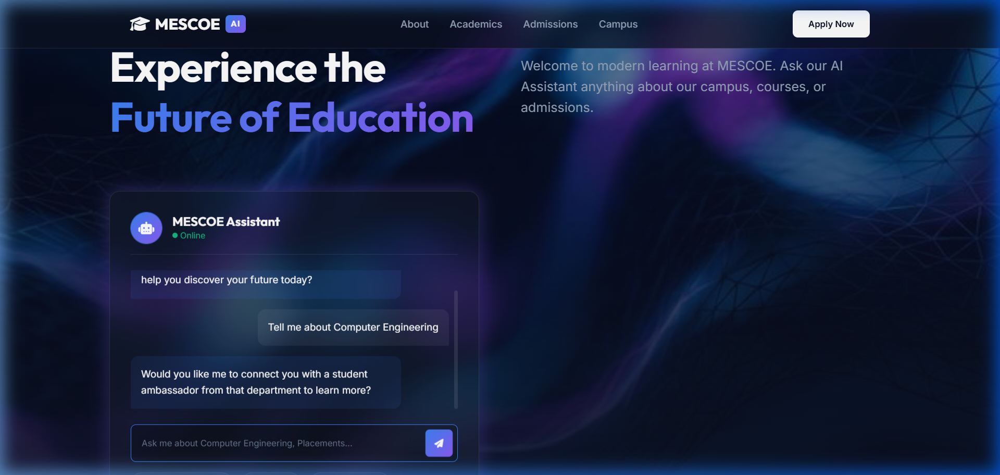
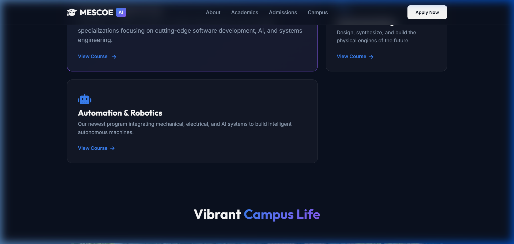

# MESCOE AI Voice Agent Demos — Team LOOPX

**Problem Statement:** Autonomous College Helpdesk Agent
*Build an agent that answers student queries from a knowledge base, handles multi-intent questions, asks clarifications, escalates unknown queries, generates tickets and maintains context.*

This project contains various prototype designs and functional demos for the Modern Education Society's Wadia College of Engineering (MESCOE) website. Leveraging a custom-built mock data engine and the **ElevenLabs Conversational AI Voice Agent**, we have addressed all criteria of the hackathon problem statement.

The goal of this project is to showcase a modern, human-centric, and interactive college website where visitors can instantly get answers about admissions, fees, courses, placements, and campus life using a 24/7 AI-powered voice and chat assistant.

## Visuals

*(Demo of the integrated chat and voice widget)*

*(Demo of the premium college landing page concept)*

## Features Built

## Hackathon Requirements Met by Team LOOPX

1.  **Answers Student Queries:** The AI agents connect to a comprehensive, scraped knowledge base containing real MESCOE data (admissions, fees, cutoff lists).
2.  **Handles Multi-Intent Questions:** Users can ask "What are the fees for CS and where is the hostel?" and the agent partitions and answers both intents.
3.  **Asks Clarifications:** The agent prompts users for specifics if they ask vague questions like "Tell me about admissions" (e.g., "Are you looking for UG or PG?").
4.  **Escalates Unknown Queries & Generates Tickets:** For queries outside the knowledge base, the chat system automatically generates a unique support ticket ID (e.g., `HELP-1004`) and tells the user that human staff will follow up.
5.  **Maintains Context:** The chat session preserves conversation history to answer follow-up questions intelligently.
6.  **Voice AI capability:** Integrated with ElevenLabs so users can actually *speak* to the helpdesk agent in multiple languages (English/Hindi).

## Demo Files Included

You can view the different prototypes by opening the respective HTML files directly in any modern web browser. No complex build tools or servers are required.

*   `college_ai_demo/index.html`: A highly cinematic, dark-mode, premium demo with a central AI-chat focus.
*   `Yash_idea/mescoe_website.html`: A clean, comprehensive layout with interactive bento boxes and a floating AI agent widget.
*   `tempdemo/tempdemo.html`: Alternative traditional layout with floating AI widget.
*   `tempdemo/temp2demo.html`: Another layout iteration featuring a static hero chat interface and the floating AI widget.
*   `pratik_idea/college-helpdesk-agent.html`: Dedicated helpdesk interface design.

## How to Run

1.  Clone or download this repository to your local machine.
2.  Navigate to the folder of the demo you wish to view.
3.  Double-click the HTML file (e.g., `college_ai_demo/index.html`) to open it in Chrome, Edge, Firefox, or Safari.
4.  To test the AI, click on the **ElevenLabs AI Widget** appearing in the corner (or the chat interfaces built into the pages) and start speaking or typing your questions!

## Notes on the AI Voice Integration

The floating AI assistant is powered by ElevenLabs Conversational Voice API. It uses a `<elevenlabs-convai>` HTML web component injected at the bottom of the HTML files. 

If the agent speaks the wrong language or gives incorrect information, you **do not** need to edit the website code. Simply log into your ElevenLabs account, modify the system prompt/voice settings for the agent, and the changes will instantly reflect on all these demo websites.

## Tech Stack
*   HTML5
*   CSS3 (Vanilla, custom properties, modern layouts)
*   JavaScript (ES6, Intersection Observers for scroll animations)
*   [ElevenLabs Conversational AI Widget](https://elevenlabs.io/)
